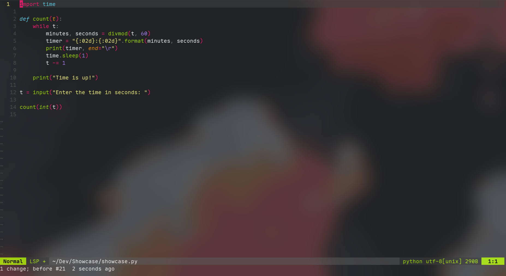

# My Dotfiles

My dotfiles for Visual Studio Code, Windows Terminal, Neovim and more.

**WARNING**: I cannot guarantee that copying the settings will work as expected. Please install all extensions listed and make a backup of your personal settings before using the ones in this repository.

## VsCode Extensions

### Productivity:

- [Vim](https://marketplace.visualstudio.com/items?itemName=vscodevim.vim)

- [expand-region](https://marketplace.visualstudio.com/items?itemName=letrieu.expand-region)

- [Project Manager](https://marketplace.visualstudio.com/items?itemName=alefragnani.project-manager)

- [Expand Region](https://marketplace.visualstudio.com/items?itemName=letrieu.expand-region)

### Formatters:

- [Prettier](https://marketplace.visualstudio.com/items?itemName=esbenp.prettier-vscode)

- [Black Formatter](https://marketplace.visualstudio.com/items?itemName=ms-python.black-formatter)

- [C/C++](https://marketplace.visualstudio.com/items?itemName=ms-vscode.cpptools)

### Theming:

- [Monokai DarkPlus](https://marketplace.visualstudio.com/items?itemName=filipeyay.monokai-darkplus)

- [Material Icon Theme](https://marketplace.visualstudio.com/items?itemName=PKief.material-icon-theme)

## Font

I use [Maple Mono Font](https://github.com/subframe7536/maple-font) as my main monospace font.
And I also use [BlexMono Nerd Font](https://github.com/ryanoasis/nerd-fonts/releases/download/v3.4.0/IBMPlexMono.zip) sometimes.

## Showcase

## Extra

For transparency check [GlassIt](https://marketplace.visualstudio.com/items?itemName=s-nlf-fh.glassit).

For blur check [Blur My Shell](https://extensions.gnome.org/extension/3193/blur-my-shell/).
