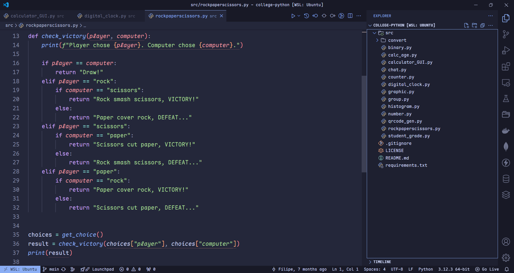
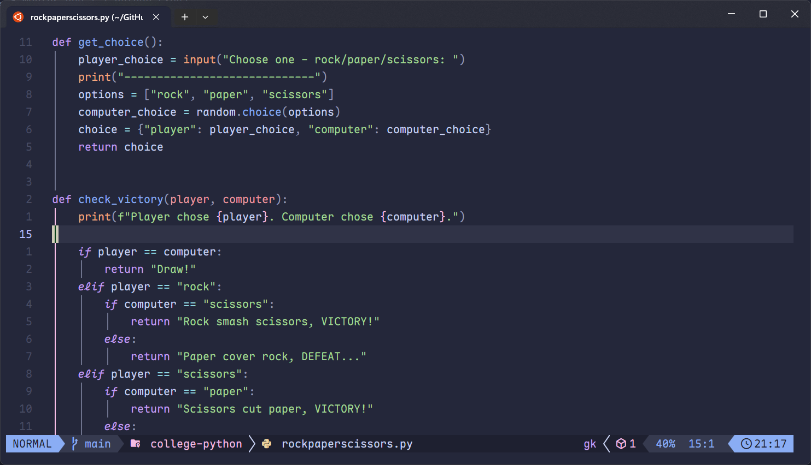

# My Dotfiles

My dotfiles for Visual Studio Code, Windows Terminal, Neovim and more.

**WARNING**: I cannot guarantee that copying the settings will work as expected. Please make a backup of your personal settings before using the ones in this repository.

## Showcase

## Get Started (VSCode Tutorial)

You'll need some VSCode extensions:

- [Custom UI Style](https://marketplace.visualstudio.com/items?itemName=subframe7536.custom-ui-style) to change UI font.
- [Catppuccin Pack](https://marketplace.visualstudio.com/items?itemName=Catppuccin.catppuccin-vsc-pack) for theme and icons.
- [Maple Font Nerd Font](https://github.com/subframe7536/maple-font) for the editor and UI font.

For NeoVim instructions go to [NeoVim Tutorial](./config/nvim/README.md)

## Fonts

I use [Maple Font Nerd Font](https://github.com/subframe7536/maple-font), a open source monospace font with round corner, ligatures and Nerd-Font for IDE and command line.

I also like [iA Writer](https://github.com/ryanoasis/nerd-fonts/releases/download/v3.2.1/iA-Writer.zip), a heavy modification of [IBM Plex Mono](https://github.com/ryanoasis/nerd-fonts/releases/download/v3.2.1/IBMPlexMono.zip) font.
