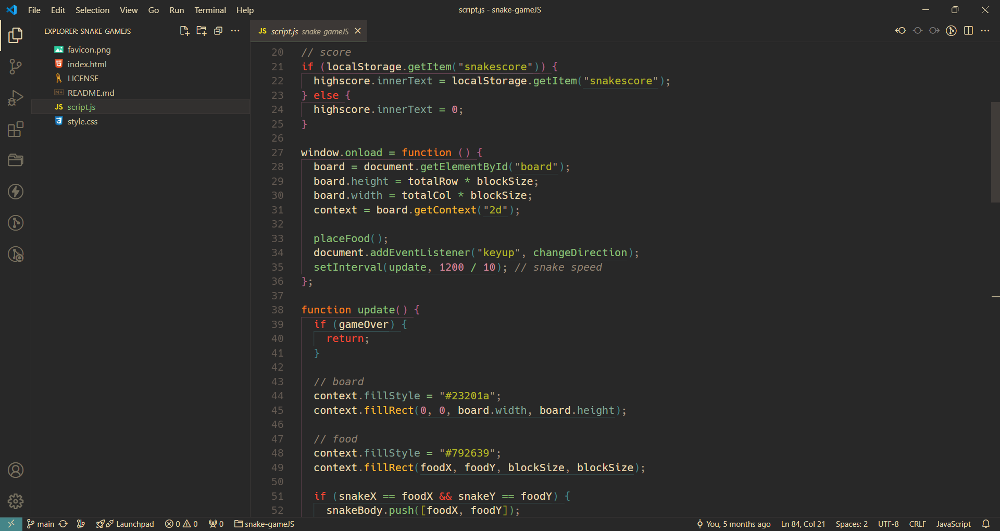
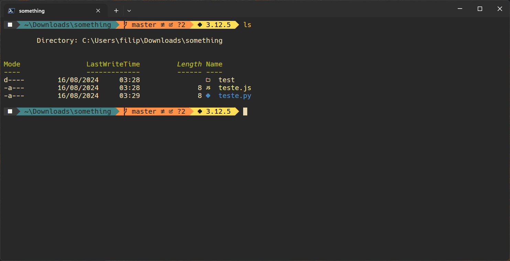

# My Dotfiles

My dotfiles for Visual Studio Code, Azure Data Studio and Windows Terminal.

### Theming

[Gruvbox VsCode Theme](https://marketplace.visualstudio.com/items?itemName=jdinhlife.gruvbox)

[Icon Theme](https://marketplace.visualstudio.com/items?itemName=vscode-icons-team.vscode-icons)

[Windows Terminal Theme](https://windowsterminalthemes.dev/) Get 'GruvboxDark' theme.

### Extensions (Visual Studio Code)

[Project Manager](https://marketplace.visualstudio.com/items?itemName=PKief.material-icon-theme)

[ESLint](https://marketplace.visualstudio.com/items?itemName=dbaeumer.vscode-eslint)

[Prettier Formatter](https://marketplace.visualstudio.com/items?itemName=esbenp.prettier-vscode)

[Python Formatter](https://marketplace.visualstudio.com/items?itemName=ms-python.black-formatter)

[Java Pack](https://marketplace.visualstudio.com/items?itemName=vscjava.vscode-java-pack)

[CodeSnap](https://marketplace.visualstudio.com/items?itemName=adpyke.codesnap)

### Font

[Hack Nerd Font](https://github.com/ryanoasis/nerd-fonts/releases/download/v3.2.1/Hack.zip)

### PowerShell

Install PowerShell from Microsoft store, then run:

`winget install JanDeDobbeleer.OhMyPosh -s winget`

The theme I use with oh-my-posh is [Gruvbox](https://github.com/JanDeDobbeleer/oh-my-posh/blob/main/themes/gruvbox.omp.json)

After that you should re-open the terminal and run the PowerShell as Admin, then run:

`Install-Module -Name Terminal-Icons -Repository PSGallery`

And then:

`Import-Module -Name Terminal-Icons`

Re-open the terminal and type `ls` and see if the icons appear on your terminal.

---

### Screenshots

