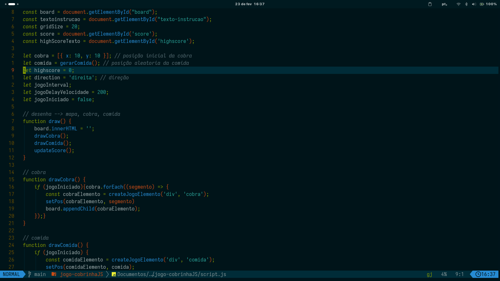
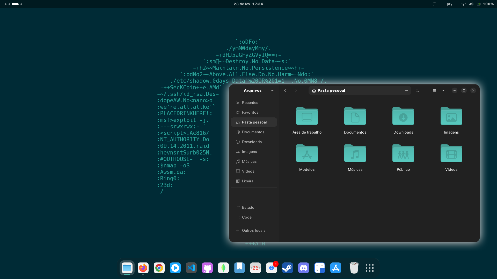

# Dotfiles

Repositorio dedicado as pricipais configurações do meu ambiente de desenvolvimento.

## Preview

## O que é preciso?

A principais ferramentas são um terminal que tenha suporte a 'true colors'
(eg: Alacritty, Kitty, wezterm, iterm2), Neovim >= 0.9.0, Git >= 0.9.0,
GCC (Compilador C), alguma Nerd Fonts de sua escolha.

## Minhas preferencias

- Alacritty (Terminal) => https://github.com/alacritty/alacritty
- Zsh (Shell) => https://github.com/ohmyzsh/ohmyzsh/wiki/Installing-ZSH
- Neovim (Editor Principal) => https://github.com/neovim/neovim
- Lazyvim (Distribuição Neovim) => https://github.com/LazyVim/LazyVim
- Lazygit (Cliente Git via Terminal) => https://github.com/jesseduffield/lazygit

## Minhas Fontes Favoritas

- Iosevka => https://github.com/be5invis/Iosevka
- Fira Code => https://github.com/tonsky/FiraCode

Você pode encontrar as versões Nerd das fontes mencionadas nesse repositorio => https://github.com/ryanoasis/nerd-fonts

## Outros

- OS: Fedora Workstation
- Tema: Jasper/ Icones: Colloid Teal

Extenções Gnome

- AppIndicator KStatusNotifierItem Support
- Blur my Shell
- Clipboard Indicator
- User Themes

### !Atenção!

É recomendado que caso deseje usar essas configurações no seu ambiente você faça
backup das suas configurações atuais para que em caso de conflito ou erro vc possa
recuperar a configuração antiga.
