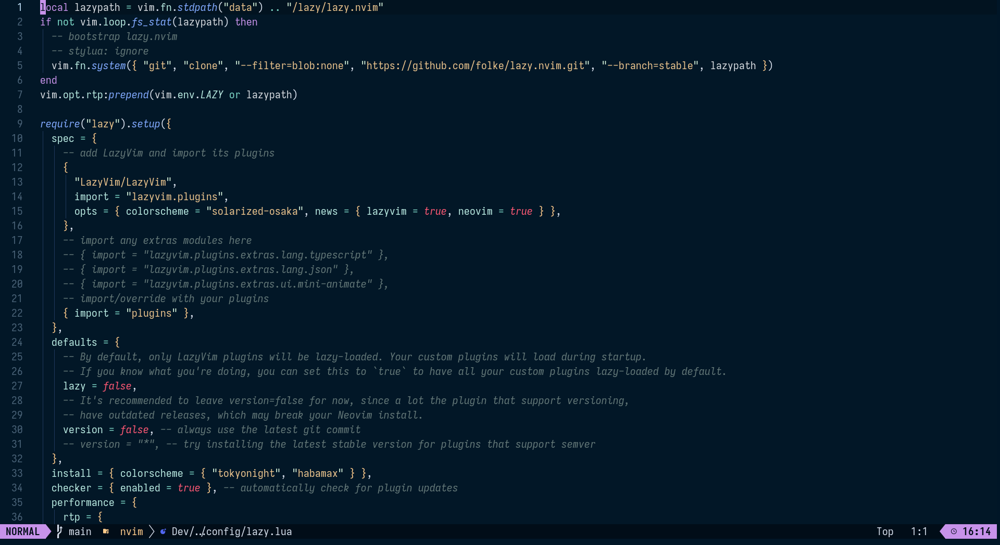

# Dotfiles

Repositório dedicado às principais configurações do meu ambiente de desenvolvimento.

## Preview

## O que é preciso?

A principais ferramentas são:

- Terminal que tenha suporte a 'true colors' (eg: Alacritty, Kitty, wezterm)
- Neovim >= 0.9.0
- Git >= 0.9.0
- GCC (Compilador C)
- Nerd Fonts de sua escolha

## Minhas preferências

- Alacritty (Terminal) -> https://github.com/alacritty/alacritty
- Zsh (Shell) -> https://github.com/ohmyzsh/ohmyzsh/wiki/Installing-ZSH
- Neovim (Editor Principal) -> https://github.com/neovim/neovim
- Lazyvim (Distribuição Neovim) -> https://github.com/LazyVim/LazyVim
- Lazygit (Cliente Git via Terminal) -> https://github.com/jesseduffield/lazygit

## Minhas Fontes Favoritas

- Inter -> https://github.com/rsms/inter
- Iosevka (Monospace) -> https://github.com/be5invis/Iosevka
- Fira Code (Monospace) -> https://github.com/tonsky/FiraCode

Você pode encontrar as versões Nerd das fontes mencionadas nesse repositorio => https://github.com/ryanoasis/nerd-fonts

## Outros (Linux)

Fedora Workstation

AppIndicator KStatusNotifierItem Support  
Blur my Shell  
Clipboard Indicator  

### !Atenção!

É recomendado que caso deseje usar essas configurações no seu ambiente você faça
backup das suas configurações atuais para que em caso de conflito ou erro vc possa
recuperar a configuração antiga.
